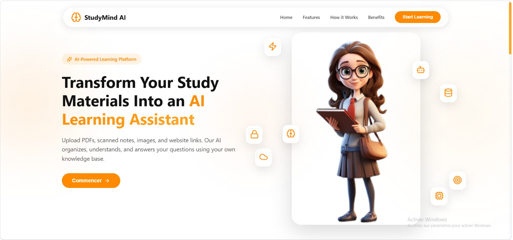
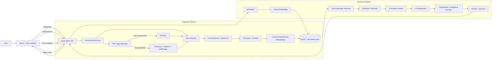
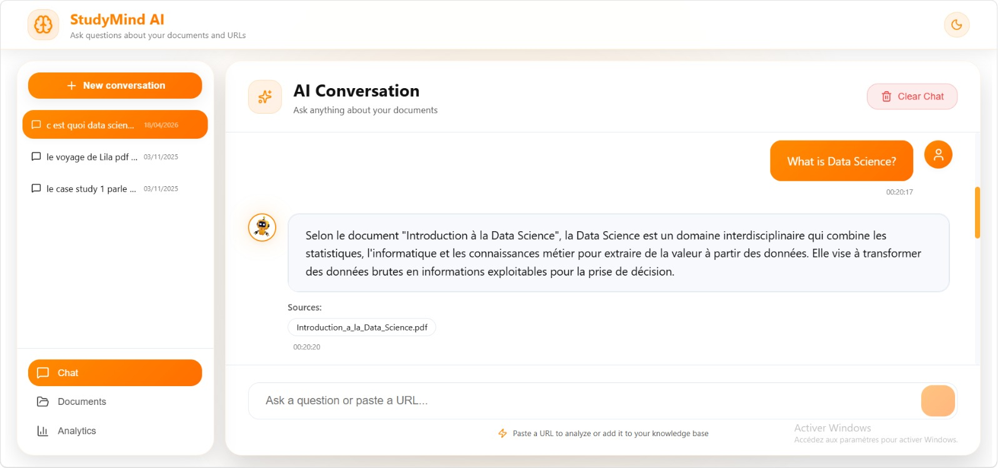
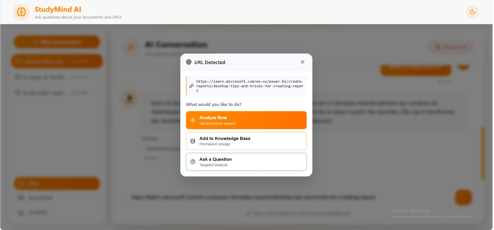
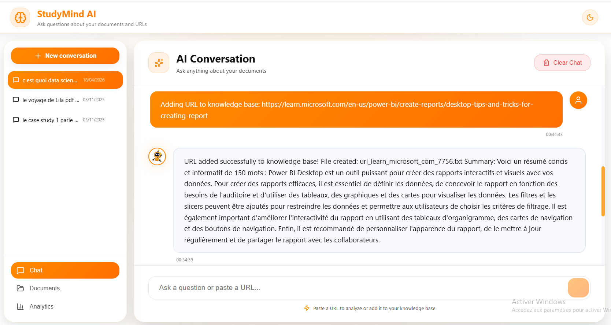
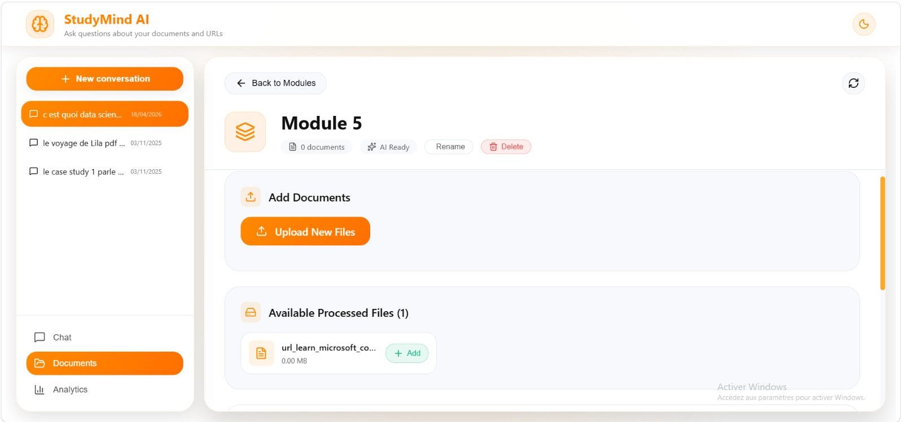
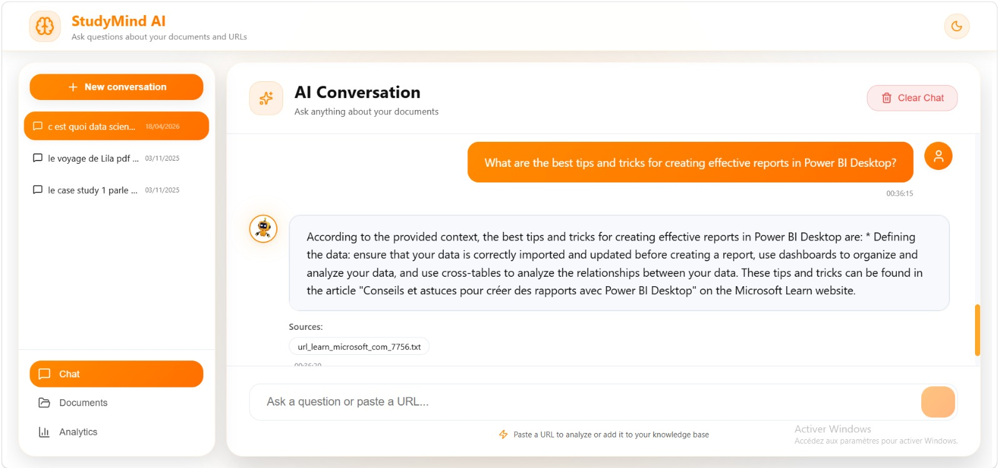
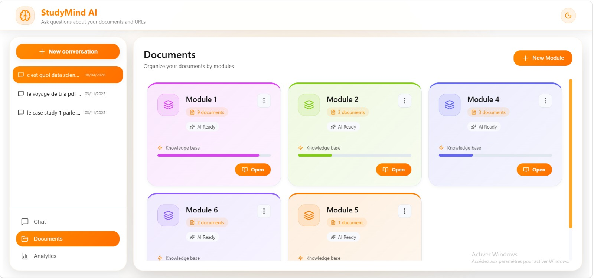
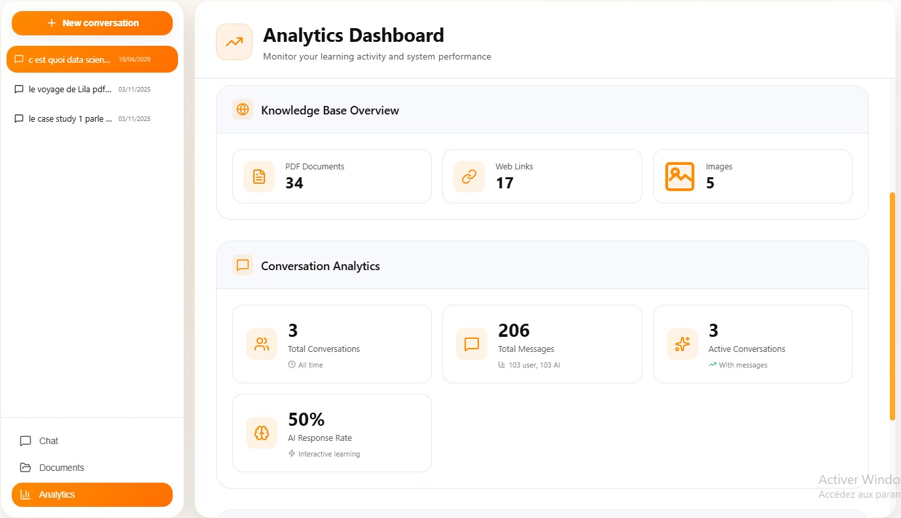

# StudyMind AI — AI Knowledge Manager

<p align="center">
  <strong>Turn scattered study material into a searchable, source-grounded AI knowledge base.</strong><br/>
  Upload PDFs, scanned notes, images and text files, organize them by module, enrich them with AI, and ask questions using a full Retrieval-Augmented Generation (RAG) pipeline.
</p>

<p align="center">
  
</p>

<p align="center">
  
  
  
  
  
  
  
  
</p>

---

## Overview

**StudyMind AI** is a full-stack AI knowledge management platform built around **Retrieval-Augmented Generation (RAG)**. It transforms heterogeneous learning material into a persistent semantic knowledge base and lets the user interact with that knowledge through a modern conversational interface.

The project is more than a chat UI connected to an LLM. It implements the full path from **document ingestion → extraction/OCR → cleaning → chunking → embeddings → vector indexing → semantic retrieval → grounded generation → source display**, with document organization and analytics on top.

The current web application is composed of:

- a **React + Vite** frontend,
- a **Flask REST API**,
- a local **FAISS vector store**,
- **Sentence Transformers** embeddings,
- **OpenRouter** for configurable LLM generation,
- **PyPDF2 + Tesseract + OpenCV + pdf2image** for document/OCR processing,
- browser-side persistence for conversations and document modules.

---

## The problem

Students and knowledge workers rarely learn from one clean source. Their information is distributed across:

- text-based PDFs,
- scanned PDFs,
- screenshots and images,
- notes and Markdown files,
- web resources,
- multiple courses or thematic modules.

A normal keyword search does not understand meaning, and a general-purpose chatbot does not automatically know the content of private study material. Even when documents are uploaded to an AI system, a second problem appears: **how do we keep answers grounded in the user's own knowledge base instead of producing generic or unsupported answers?**

There is also an engineering challenge: newly indexed documents must become searchable immediately, OCR has to handle low-quality scans, and the application needs to preserve the relationship between answers and their source documents.

---

## The solution

StudyMind AI builds a local knowledge layer between raw documents and the LLM.

When a document is added, the backend detects how it should be processed, extracts its text, cleans the content, generates metadata, splits large content into overlapping chunks, creates semantic embeddings and persists them in FAISS. When a question is asked, only the most relevant chunks are retrieved and injected into the LLM context.

This changes the interaction from:

> **"Ask a model something and hope it knows."**

into:

> **"Retrieve the most relevant evidence from my own material, then ask the model to answer from that evidence."**

The result is a system designed for **grounded, contextual and traceable question answering**.

---

## Key capabilities

### Intelligent document ingestion

The ingestion pipeline handles the formats used most often in real study material:

- text PDFs,
- scanned PDFs,
- JPG / JPEG / PNG / TIFF / BMP images,
- TXT files,
- Markdown files.

PDFs are first analyzed to determine whether they contain selectable text or behave like scanned documents. Text PDFs are processed directly with **PyPDF2**, while scanned content is routed through the OCR pipeline.

### OCR built for imperfect scans

The OCR layer is not a single `pytesseract` call. It combines:

- **Tesseract OCR**,
- **OpenCV** preprocessing,
- several page segmentation strategies,
- contrast enhancement,
- denoising,
- border cleanup,
- resizing when needed,
- confidence-aware OCR selection,
- French + English OCR languages,
- post-OCR text corrections.

This makes the ingestion pipeline capable of handling both clean digital documents and less structured scanned material.

### Semantic RAG pipeline

The knowledge base uses:

- `all-MiniLM-L6-v2` Sentence Transformer embeddings,
- 384-dimensional vectors,
- configurable chunking with overlap,
- FAISS `IndexFlatIP` similarity search,
- configurable retrieval threshold,
- top-k context selection,
- source metadata preservation.

Large documents are automatically divided into overlapping chunks so the retriever can locate the relevant passage instead of sending an entire document to the LLM.

### Grounded question answering

For every question, the backend:

1. creates an embedding for the query,
2. retrieves the most relevant indexed chunks,
3. filters them using the configured similarity threshold,
4. builds a compact context from the selected evidence,
5. asks the configured LLM to answer from that context,
6. returns both the generated answer and the source files used.

The RAG prompt explicitly tells the model to stay inside the retrieved context and to say when the information is not present.

### Fresh knowledge after every ingestion

A deliberate design choice in the Flask API is to create fresh QA/vector-store components for incoming requests. This prevents the chatbot from keeping a stale in-memory view of the knowledge base after a new document has been processed.

That means an uploaded and indexed document can be reflected in subsequent searches without requiring a full application restart.

### AI enrichment during ingestion

The LLM integration is also used to enrich newly processed content with:

- concise summaries,
- extracted keywords,
- metadata stored alongside the indexed content.

### URL workflow

The chat detects URLs and exposes three workflows:

- **Analyze now** — process the URL for an immediate answer,
- **Add to knowledge base** — persist the extracted content and run it through the document/RAG pipeline,
- **Ask a question** — query the URL content directly in context.

The URL workflow is model/provider-dependent in the current implementation: the configured LLM is asked to work from the URL. If a selected provider cannot access remote page content, this layer can be extended with a dedicated HTTP/HTML extractor.

### Modular knowledge organization

Processed files can be grouped into user-defined modules. Modules can be created, renamed and populated with newly uploaded or already processed files.

The module organization is persisted in the browser with `localStorage`, keeping the UI lightweight while the actual semantic knowledge base remains on the backend.

### Conversation management

The frontend supports:

- multiple conversations,
- conversation switching,
- conversation deletion,
- clear-chat actions,
- persistent conversation history in `localStorage`,
- source display below AI answers.

### Analytics dashboard

The dashboard combines backend vector-store statistics with frontend conversation activity, including:

- indexed vector entries,
- unique source files,
- embedding count,
- configured LLM provider,
- conversation count,
- user/AI message activity.

---

## System architecture



---

## RAG pipeline in detail

```text
Raw document / image / URL
          │
          ▼
   Type detection
          │
          ├── Text PDF ──────────────► PyPDF2 extraction
          │
          ├── Scanned PDF / image ───► OCR + image preprocessing
          │
          └── TXT / Markdown ─────────► Encoding-aware text reader
                                      │
                                      ▼
                                Text cleaning
                                      │
                                      ▼
                             Summary + keywords
                                      │
                                      ▼
                         Chunking with overlap
                                      │
                                      ▼
                    SentenceTransformer embeddings
                                      │
                                      ▼
                         Persistent FAISS index
                                      │
                    ┌─────────────────┴───────────────┐
                    │                                 │
               User question                    New content
                    │                                 │
                    ▼                                 │
              Query embedding                         │
                    │                                 │
                    ▼                                 │
             Semantic retrieval ◄─────────────────────┘
                    │
                    ▼
             Relevance filtering
                    │
                    ▼
             Context construction
                    │
                    ▼
                 LLM
                    │
                    ▼
          Grounded answer + sources
```

---

## Product walkthrough

### 1. Landing experience

The landing page introduces the core idea immediately: transform study material into an AI learning assistant.

<p align="center">
  
</p>

### 2. Ask questions about indexed documents

The chat retrieves relevant knowledge from the indexed material and returns the answer together with the source document used as evidence.

<p align="center">
  
</p>

### 3. Smart URL detection

When a URL is detected, the interface proposes multiple actions instead of treating the link as ordinary text.

<p align="center">
  
</p>

### 4. Add web knowledge to the knowledge base

URL content can be processed, summarized and persisted so it becomes part of the searchable knowledge base.

<p align="center">
  
</p>

### 5. Manage documents inside learning modules

Each module acts as an organizational layer for processed study material. Users can upload new documents or associate existing processed files with a module.

<p align="center">
  
</p>

### 6. Ask questions across ingested web content

Once web content is part of the knowledge base, it can participate in the same retrieval and grounded-answer workflow as local documents.

<p align="center">
  
</p>

### 7. Organize the knowledge base visually

The Documents workspace provides a modular overview so knowledge can be separated by course, topic or project.

<p align="center">
  
</p>

### 8. Monitor the system and conversations

The analytics page exposes the state of the vector knowledge base and conversation activity in one interface.

<p align="center">
  
</p>

---

## Technology stack

| Layer | Technologies | Role |
|---|---|---|
| Frontend | React 18, Vite, JavaScript | Interactive single-page application |
| UI | CSS, Lucide React | Custom interface and icon system |
| HTTP client | Axios | Frontend ↔ Flask communication |
| Backend | Python, Flask, Flask-CORS | REST API and application orchestration |
| Embeddings | Sentence Transformers | Semantic vector representation |
| Embedding model | `all-MiniLM-L6-v2` | 384-dimensional text embeddings |
| Vector search | FAISS | Local semantic retrieval |
| LLM gateway | OpenRouter | Configurable generative model access |
| PDF extraction | PyPDF2 | Text-based PDF parsing |
| OCR | Tesseract, pytesseract | Text recognition from scans/images |
| Image processing | OpenCV, NumPy | OCR preprocessing and enhancement |
| PDF-to-image | pdf2image + Poppler | Scanned PDF OCR pipeline |
| Persistence | FAISS files + JSON | Local vector index and document metadata |
| UI persistence | Browser `localStorage` | Conversations and module organization |

The LLM abstraction also contains provider implementations for **OpenAI, Ollama and Hugging Face**, making the generation layer extensible beyond OpenRouter.

---

## Project structure

```text
ai-knowledge-manager/
│
├── backend/
│   ├── app.py                     # Flask REST API
│   ├── config.py                  # Local configuration (do not commit secrets)
│   ├── config.example.py          # Safe configuration template
│   ├── requirements.txt
│   ├── data/
│   │   ├── incoming/              # Newly uploaded content
│   │   ├── processing/            # Temporary processing area
│   │   ├── processed/             # Successfully processed source files
│   │   ├── failed/                # Failed processing attempts
│   │   └── vector_store/          # FAISS index + document metadata
│   │
│   └── src/
│       ├── core/
│       │   ├── document_processor.py
│       │   ├── pdf_processor.py
│       │   ├── ocr_processor.py
│       │   ├── text_cleaner.py
│       │   ├── vector_store.py
│       │   ├── qa_engine.py
│       │   ├── llm_integration.py
│       │   └── url_processor.py
│       ├── file_monitor/
│       └── models/
│
├── frontend/
│   ├── package.json
│   ├── vite.config.js
│   └── src/
│       ├── components/
│       ├── hooks/
│       ├── pages/
│       │   ├── Documents/
│       │   ├── LandingPage.jsx
│       │   ├── Stats.jsx
│       │   └── chat.jsx
│       └── services/api.js
│
└── demo/                          # Screenshots used in this README
```

---

# Getting started

The instructions below are written for **Windows + PowerShell**, which is the environment used to run the project during development.

## 1. Prerequisites

Install:

- **Git**
- **Python 3.10** (recommended for this project)
- **Conda / Miniconda / Anaconda** or another Python virtual environment manager
- **Node.js 18+** and npm
- **Tesseract OCR**
- **Poppler for Windows**
- an **OpenRouter API key**

For OCR in both languages, make sure Tesseract has the language data for:

```text
eng
fra
```

---

## 2. Clone the repository

```powershell
git clone https://github.com/ranya20/ai-knowledge-manager.git
cd ai-knowledge-manager
```

---

## 3. Create or activate the Python environment

Example with Conda:

```powershell
conda create -n studymind-ai python=3.10 -y
conda activate studymind-ai
```

If you already have a working Conda environment, simply activate it instead.

---

## 4. Install backend dependencies

```powershell
cd backend
pip install -r requirements.txt
```

The web application itself uses the core RAG/OCR dependencies from this requirements file. Some experimental/legacy NLP utilities under `backend/src/models/` may require additional packages such as `transformers`, `sumy` or `keybert` if you choose to run those modules separately.

---

## 5. Configure OCR paths

Open:

```text
backend/src/core/ocr_processor.py
```

Set the two paths according to your machine:

```python
POPPLER_PATH = r"C:\path\to\poppler\Library\bin"
TESSERACT_PATH = r"C:\Program Files\Tesseract-OCR\tesseract.exe"
```

These paths are machine-specific and should not be copied blindly from another computer.

---

## 6. Configure the LLM

Create your local configuration from the public template:

```powershell
Copy-Item config.example.py config.py
```

Open `backend/config.py` and configure:

```python
LLM_PROVIDER = "openrouter"
OPENROUTER_API_KEY = "YOUR_OPENROUTER_API_KEY"
OPENROUTER_MODEL = "YOUR_CURRENT_OPENROUTER_MODEL_ID"
```

Use a model ID that is currently available through your OpenRouter account/provider configuration.

> **Security:** `backend/config.py` must remain local and must not be committed when it contains a real API key. Keep only `config.example.py` in the public repository.

---

## 7. Start the backend

From the `backend` directory:

```powershell
python app.py
```

The Flask API starts on:

```text
http://localhost:5000
```

Health check:

```text
http://localhost:5000/api/health
```

Expected response:

```json
{
  "status": "OK",
  "message": "API RAG fonctionnelle"
}
```

Keep this terminal open.

---

## 8. Start the frontend

Open a **second PowerShell terminal**:

```powershell
cd path\to\ai-knowledge-manager\frontend
npm install
npm run dev
```

Vite starts the application at:

```text
http://localhost:5173
```

Open that address in your browser.

---

## Quick start after the first installation

Once dependencies and configuration are already installed, only two terminals are needed.

**Terminal 1 — Backend**

```powershell
cd path\to\ai-knowledge-manager\backend
conda activate studymind-ai
python app.py
```

**Terminal 2 — Frontend**

```powershell
cd path\to\ai-knowledge-manager\frontend
npm run dev
```

Then open:

```text
http://localhost:5173
```

---

## REST API

| Method | Endpoint | Purpose |
|---|---|---|
| `POST` | `/api/ask` | Ask a RAG question over the indexed knowledge base |
| `POST` | `/api/upload` | Upload and process a document |
| `POST` | `/api/process-url` | Process a URL for an immediate chat response |
| `POST` | `/api/add-url` | Add URL-derived content to the knowledge base |
| `GET` | `/api/stats` | Retrieve vector-store/system statistics |
| `GET` | `/api/files` | List processed files |
| `POST` | `/api/refresh` | Reload vector-store state |
| `GET` | `/api/health` | Backend health check |

Example question request:

```powershell
Invoke-RestMethod `
  -Uri "http://localhost:5000/api/ask" `
  -Method Post `
  -ContentType "application/json" `
  -Body '{"question":"What is Data Science?"}'
```

---

## Important configuration parameters

The RAG behavior can be tuned from `backend/config.py`.

| Parameter | Default in the project | Meaning |
|---|---:|---|
| `EMBEDDING_MODEL` | `all-MiniLM-L6-v2` | Sentence Transformer used for embeddings |
| `EMBEDDING_DIMENSION` | `384` | Embedding vector dimension |
| `CHUNK_SIZE` | `1000` | Maximum text size per chunk |
| `CHUNK_OVERLAP` | `100` | Context overlap between consecutive chunks |
| `SIMILARITY_THRESHOLD` | `0.3` | Minimum retrieval relevance threshold |
| `MAX_CONTEXT_DOCS` | `5` | Maximum retrieved chunks passed to the LLM |
| `SEARCH_TOP_K` | `10` | Retrieval search breadth |
| `OCR_DPI` | `300` | PDF-to-image OCR rendering resolution |
| `OCR_LANGUAGES` | `fra`, `eng` | OCR languages |

---

## Data lifecycle

```text
Upload
  ↓
data/incoming
  ↓
Extraction / OCR / cleaning
  ↓
RAG enrichment + vector indexing
  ↓
┌──────────────────────────────┐
│ data/processed              │  Original processed source
│ data/vector_store           │  FAISS index + metadata
└──────────────────────────────┘

If processing fails:
  ↓
data/failed
```

The vector store is persisted locally, so indexed knowledge survives application restarts.

---

## Security and repository hygiene

Do **not** publish:

- real API keys,
- `backend/config.py` if it contains secrets,
- `.env` files,
- local Conda/virtual environments,
- `node_modules`,
- private processed documents,
- local FAISS/vector-store data if it contains private source content.

A public repository should keep only a safe `config.example.py` with placeholder credentials.

Recommended `.gitignore` entries include:

```gitignore
# Secrets
.env
*.env
backend/.env
backend/config.py

# Python
__pycache__/
*.pyc
backend/.venv/
backend/venv/

# Node
frontend/node_modules/
frontend/dist/

# Local RAG data
backend/data/incoming/
backend/data/processing/
backend/data/processed/
backend/data/failed/
backend/data/vector_store/
```

---

## Engineering decisions worth highlighting

### 1. Retrieval before generation

The LLM is not treated as the knowledge database. FAISS first retrieves evidence from the user's indexed material; generation comes afterward.

### 2. Separate ingestion and retrieval responsibilities

Document processing, OCR, vector storage, question answering and LLM access are separated into dedicated classes. This keeps the architecture extensible and easier to debug.

### 3. Persistent local semantic memory

The FAISS index and document metadata are saved to disk instead of being kept only in RAM.

### 4. Fresh state for new documents

The API intentionally reloads RAG components for requests so recently ingested material is visible without restarting Flask.

### 5. Provider abstraction

`LLMIntegration` isolates provider-specific behavior. OpenRouter is the main configured path, while OpenAI, Ollama and Hugging Face implementations are also represented in the architecture.

### 6. Graceful fallback behavior

The QA engine includes a non-LLM fallback path when no generative answer is requested or when no relevant evidence exists.

---

## Current scope and extension opportunities

StudyMind AI is an end-to-end RAG application and a strong base for further engineering. Natural next steps include:

- direct HTML extraction for URL ingestion instead of relying on LLM URL access,
- DOCX ingestion wired into the active document processor,
- authentication and per-user knowledge bases,
- database-backed module/conversation persistence,
- reranking after FAISS retrieval,
- hybrid lexical + vector search,
- streaming LLM responses,
- document-level permissions,
- automated evaluation for retrieval quality and grounded-answer quality,
- containerization with Docker,
- production WSGI deployment instead of Flask's development server,
- CI/CD and automated backend/frontend tests.

---

## Why this project matters

StudyMind AI demonstrates how several AI and software-engineering components can be combined into one coherent product:

**document intelligence + OCR + NLP + embeddings + vector search + RAG + LLM orchestration + REST APIs + React UX + persistent application state.**

The value of the project is not just the final chatbot. It is the complete pipeline that turns messy, heterogeneous source material into structured semantic memory that can be searched and questioned interactively.

---

## Author

**Ranya Adraou**  
GitHub: [@ranya20](https://github.com/ranya20)

---

<p align="center">
  <strong>StudyMind AI</strong><br/>
  From scattered documents to structured, searchable knowledge.
</p>
